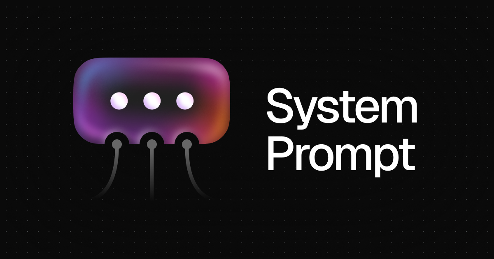

# System Prompt
### Make your AI workflows reusable and efficient

## 🚀 What is System Prompt?

**System Prompt** is a free, open-source, locally-run tool that transforms how you interact with AI models. Stop repeating yourself and start building reusable AI workflows with our intuitive visual canvas.

## ✨ Key Features

- **🔄 Reusable Templates**: Save your AI instructions once, use them forever
- **🎨 Visual Canvas**: Build complex AI workflows with drag-and-drop simplicity  
- **🔗 Chain Operations**: Connect multiple AI models and create powerful pipelines
- **🔑 Bring Your Own API**: Use any AI model with your own API keys
- **💻 Local & Private**: Runs entirely in your browser - your data stays with you
- **🆓 Completely Free**: Open-source and always will be

## 💡 Use Cases

**Email Management**
- Create email response templates with specific tone and style
- Just change the input email, get consistent professional responses

**Content Creation**
- Design once, deploy everywhere: Create social media posts for Twitter, LinkedIn, and Instagram from a single input
- Maintain brand voice across all platforms

**Data Processing**
- Build multi-step analysis workflows
- Chain data cleaning, analysis, and reporting operations

*and many more... check out the [demo examples](https://systemprompt.app)*

## 🛠️ How It Works

1. **Create Nodes**: Add AI model nodes to your canvas
2. **Define Instructions**: Set up your system prompts and parameters
3. **Connect & Chain**: Link nodes to create complex workflows
4. **Save & Reuse**: Your templates are ready for any future use

## 🚀 Get Started

Try it now at **[systemprompt.app](https://systemprompt.app)** - no installation required!

## 📚 Credits

- **Canvas**: Powered by [React Flow](https://reactflow.dev/) for smooth visual interactions
- **Inspiration**: Influenced by [tldraw computer](https://computer.tldraw.com/) with a focus on control and production-ready AI workflows

## 📄 License

Open source MIT and free to use. See LICENSE for details.
