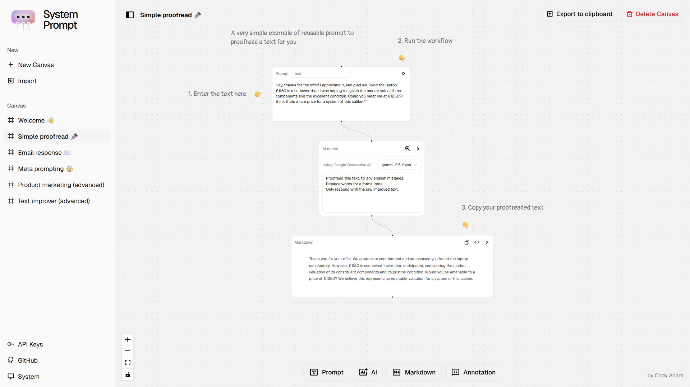

<a href="https://systemprompt.app/" target="_blank" rel="noopener">
  <picture>
    <source media="(prefers-color-scheme: dark)" alt="System Prompt" srcset="./public/og-dark.png" />
    
  </picture>
</a>

<h4 align="center">
  <a href="https://systemprompt.app">System Prompt App</a>
</h4>

  <h2>
    Free node-based AI workflow builder.  
    Reusable and efficient for productivity.  
   
  </h2>

 

  
  
  

  <figure>
    <a href="https://systemprompt.app" target="_blank" rel="noopener">
      <picture>
        <source media="(prefers-color-scheme: dark)" srcset="./public/screenshot-dark.png" />
        
      </picture>
    </a>
    <figcaption>
      

        Create reusable AI tasks with drag-and-drop nodes. Fully local, free, and open-source. Use any AI model with your own API keys.
      

    </figcaption>
  </figure>

## Features

System Prompt offers:

- 💯&nbsp;Free & open-source.
- 🎨&nbsp;Infinite canvas, node-based workflow builder.
- 🔄&nbsp;Reusable AI templates and workflows.
- 🔗&nbsp;Chain multiple AI operations seamlessly.
- 🔑&nbsp;Bring your own API keys - works with any AI model.
- 💻&nbsp;Runs entirely in your browser - your data stays private.
- 🌓&nbsp;Dark mode support.
- 📱&nbsp;Responsive design works on all devices.
- 💾&nbsp;Local storage - your workflows are saved automatically.
- 🎯&nbsp;Drag-and-drop node creation and connection.
- ✍️&nbsp;Rich text editing with markdown support.
- 📊&nbsp;Visual flow connections between nodes.
- 🏷️&nbsp;Annotation nodes for documentation.

## Use Cases

**Email Management**
- Create email response templates with specific tone and style
- Just change the input email, get consistent professional responses

**Content Creation**
- Design once, deploy everywhere: Create social media posts for Twitter, LinkedIn, and Instagram from a single input
- Maintain brand voice across all platforms

**Data Processing**
- Build multi-step analysis workflows
- Chain data cleaning, analysis, and reporting operations

*and many more... check out the [demo examples](https://systemprompt.app)*

## Quick start

**Note:** System Prompt runs entirely in your browser - no installation required!

Simply visit [systemprompt.app](https://systemprompt.app) and start building:

1. **Create Nodes**: Add prompt, AI, markdown, or annotation nodes to your workflow
2. **Define Instructions**: Set up your system prompts and parameters
3. **Connect & Chain**: Link nodes to create complex workflows
4. **Save & Reuse**: Your templates are ready for any future use

## Node Types

Each node has a Run button, when you click on it, it will run the node and send the result to the next connected node.

- **Prompt Nodes**: It's a text input, you can use it to provide inputs to your AI nodes. Add a label to differentiate between different prompt nodes.
- **AI Nodes**: Take any inputs like prompt nodes and generate an LLM response based those inputs, the AI model you choose and the system prompt you provide.
- **Markdown Nodes**: Format and display outputs as Markdown text from any node connected to it.
- **Annotation Nodes**: Add documentation and guidance to your workflow. (Not runnable)

## Contributing

- Missing something or found a bug? [Report here](https://github.com/yourusername/system-prompt/issues).
- Want to contribute? Check out our contribution guide.
- Have ideas for new features? Let us know in the discussions.

## Credits

- **Node-based graph**: Powered by [React Flow](https://reactflow.dev/) for smooth visual interactions
- **Inspiration**: Influenced by [tldraw computer](https://computer.tldraw.com/) with a focus on control and production-ready AI workflows

## License

Open source MIT and free to use. See LICENSE for details.
